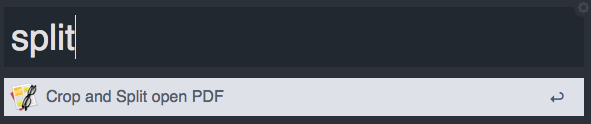
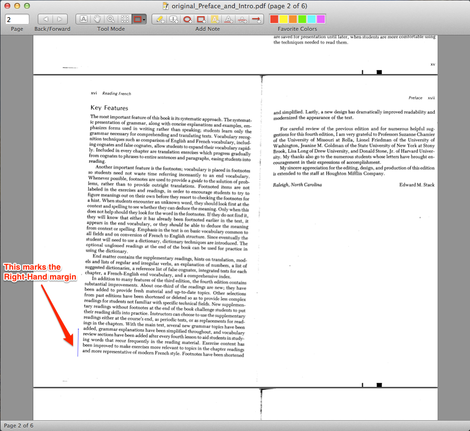
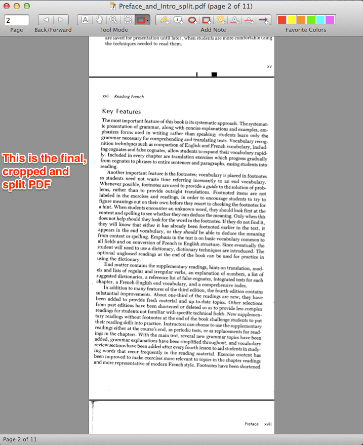
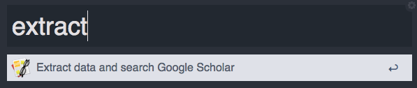

# Skimmer

### PDF Actions for [Skim](http://skim-app.sourceforge.net/) ###

#### Version 1.3

To **download**, visit the [page on Packal](http://www.packal.org/workflow/skimmer), the workflow aggregator for Alfred, where you will be able to update to the newest versions.

## Description
This is a fairly simple workflow that works with the free [Mac PDF app Skim](http://skim-app.sourceforge.net/). Skim is a fantastic app with great Applescript support. This workflow provides quick, easy access to a few custom Applescripts that I've written to deal with certain pesky problems I come across when dealing with PDFs. In this initial release, there are only 2 actions:

* Crop and Split PDF
* Extract Data and Search Google Scholar
 
First, `Skimmer` allows you to properly format those darned scanned PDFs. You know the ones I'm talking about, 2 books pages scanned into one, landscape-oriented PDF page. I want all of my PDFs in pretty, proper format with one PDF page corresponding to one portrait-oriented book/article page. In the past, it was quite the ordeal to crop the PDF so that the right- and left-hand margins were equal, and then to split each individual page and finally reconstruct the entire PDF. `Skimmer` makes this whole process as simple as π. You can use either a Hotkey or the Keyword `split` to activate this feature. 
 

`Skimmer` then does 3 things:

* Crop the PDF using a user-inserted Line Annotation (if necessary) (see image below)
* Split the two-page PDF into individual pages
* Re-assemble everything and clean up
 
Let me walk you thru the process. To begin, you will need to ensure that the two scanned book pages have equal margins. `Skimmer` will split the PDF page right down the middle, so we want the middle of the PDF to be the middle of the two pages. If the margins are unequal, you only need to use Skim's Line Annotation to create a border for `Skimmer`. Here's an example:
 

 
Note the small, vertical line at the bottom of the page. `Skimmer` will crop off everything to the left of this line. You could put the line anywhere on the page. If you the right-hand margin were too big, you could put it to the right, and `Skimmer` would automatically crop the excess stuff to the right of that line. If both margins are too big, you can put two lines on each side and `Skimmer` will take care of the rest. **Note**, `Skimmer` will crop *every* page at this point, so find the farthest extremity on any page and use that as your guide. `Skimmer` can tell what page you are looking at, so it'll make things work (note that in the image above, this is one of the middle pages being used as the cropping template). `Skimmer` does not crop Top or Bottom Margins, so you will need to manually crop PDFs with wacky top and/or bottom margins.
 
Once `Skimmer` has cropped the PDF, it will go thru and split each page into two separate pages. Depending on the length of the PDF, this can take a bit (appr. 0.33 seconds per original PDF page). This is all done invisibly tho, so that's a bonus. In order to ensure that `Skimmer` splits the PDF properly, regardless of orientation, the script will split the first page and ask you what portion of the page you are seeing (left-hand, right-hand, top-half, or bottom-half). Your choice will ensure that `Skimmer` does the splitting just so.
 
After it splits all the pages, `Skimmer` will save a copy of your original PDF and then close it as it opens the new, split PDF. This new PDF will be properly formatted and saved in the same folder as the original PDF. Here's an example of the PDF above after it was automatically cropped and split:
 

 
For anyone who deals with lots of scanned PDFs, I can promise you, this is a godsend. 
 
- - -
 
The second feature will take OCR'd PDFs and try to extract relevant search information and then search Google Scholar (which will make it easy to then add citation information to your citation manager of choice. Users of [ZotQuery](http://hackademic.postach.io/zotquery-an-alfred-workflow-for-zotero) will immediately see where I'm going with this...). This feature can be activated by a user-assigned Hotkey or by the Keyword `extract` when the desired PDF is open in Skim. 
 

 
This feature will look for three possible things in the currently viewed page: 

* a [DOI](http://www.doi.org/) (Digital Object Identifier)
* an ISBN (for books)
* JSTOR title page
 
If it cannot find any of these things, it will present the user with a list of Capitalized Words from the currently viewed page. You then select whichever words you want to be the Google Scholar query. Once the query is chosen (whether automatically as one of the 3 types above, or user-chosen keywords), `Skimmer` will automatically launch your default browser to Google Scholar using the query. What you do from there is up to you. 
 
- - -
 
As I said, these are the only two functions for `Skimmer` currently, but I will be adding at least one more (for exporting notes) soon enough. If you have any killer Applescripts for Skim app, let me know and maybe we can add them in. 
 
Here's to PDF management, 
stephen

